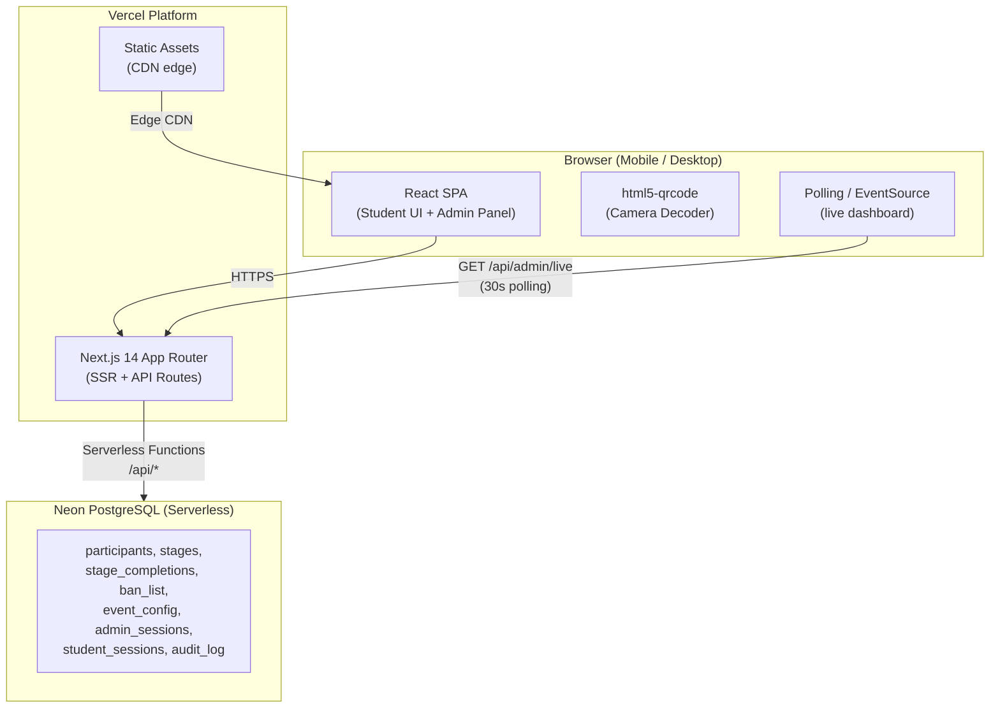

# Design Document — College Treasure Hunt

## Overview

The College Treasure Hunt is a full-stack, mobile-first web application for RJMMsVishwakamal Mahavidhayal events. Students register with their name and phone number, then navigate 5 sequential QR-code stations around campus, solving progressively harder puzzles at each stage. A real-time Admin Panel lets event operators manage scheduling, content, participants, ban lists, and styled QR code generation.

### Key Design Goals

- **Server-authoritative**: All time values, session state, and stage progression are controlled server-side to prevent cheating.
- **Dropout safety**: Sessions are auto-cancelled on tab close, navigation away, or 30-minute inactivity, keeping the event fair.
- **Real-time admin visibility**: Stage completions propagate to the admin dashboard within 5 seconds via Server-Sent Events.
- **Mobile-first**: Designed for 320px–1920px viewports; minimum 44×44px tap targets throughout.
- **Professional QR branding**: Styled QR codes with gradient colours, logo overlay, and decodability verification are generated server-side.

---

## Architecture

### High-Level Component Diagram



### Why Vercel + Next.js (not Node + Nginx)

Vercel runs **serverless functions** — there is no persistent long-running Node process. This has one key implication:

| Concern | Solution |
|---|---|
| No persistent SSE connection (serverless functions terminate after response) | Replace SSE with **client-side polling** every 5–10 seconds on `/api/admin/live` — fits within Vercel's serverless model and still meets the "within 5 seconds" update requirement |
| No background cron for session inactivity sweep | Use **Vercel Cron Jobs** (built-in) — configure a cron at `*/5 * * * *` calling `/api/cron/sweep-sessions` |
| No in-memory SSE registry | Not needed with polling — each poll fetches fresh state from DB |
| Database connection pooling | Use **Neon PostgreSQL** (serverless Postgres with connection pooling built-in) or **Supabase** — both have Vercel integrations and handle cold-start connection overhead |
| HTTPS | Vercel provides HTTPS automatically for all deployments including custom domains |
| HTTP → HTTPS redirect | Vercel handles this automatically — no Nginx needed |

### Deployment Topology

```
Student / Admin Browser
        │  HTTPS (auto by Vercel)
        ▼
Vercel Edge Network (CDN for static assets)
        │
        ▼
Next.js Serverless Functions  (/api/*)
        │  TCP (serverless connection pooling)
        ▼
Neon PostgreSQL  (managed, serverless-compatible)
```

### Project Structure

```
/
├── app/                        # Next.js App Router
│   ├── (student)/              # Student-facing routes
│   │   ├── page.tsx            # / → redirect
│   │   ├── register/page.tsx
│   │   ├── register/success/page.tsx
│   │   ├── stage/[stage]/page.tsx
│   │   ├── qr/scan/[stage]/page.tsx
│   │   ├── congratulations/page.tsx
│   │   └── countdown/page.tsx
│   ├── (admin)/                # Admin routes
│   │   └── admin/
│   │       ├── login/page.tsx
│   │       ├── dashboard/page.tsx
│   │       ├── progress/page.tsx
│   │       ├── leaderboard/page.tsx
│   │       ├── content/page.tsx
│   │       ├── qr/page.tsx
│   │       ├── ban/page.tsx
│   │       ├── schedule/page.tsx
│   │       ├── participants/page.tsx
│   │       ├── audit-log/page.tsx
│   │       └── sitemap/page.tsx
│   └── api/                    # API Route Handlers
│       ├── time/route.ts
│       ├── student/
│       ├── admin/
│       └── cron/
├── components/
├── lib/                        # DB client, auth helpers, services
└── vercel.json                 # Cron job config
```

---

## Technology Stack

| Layer | Choice | Justification |
|---|---|---|
| **Framework** | Next.js 14 (App Router) | Full-stack on Vercel — API routes + SSR + static pages in one project; no separate server needed |
| **Frontend styling** | Tailwind CSS | Mobile-first utility classes; 44px tap-target helpers; zero runtime overhead |
| **Backend** | Next.js API Route Handlers (serverless) | Runs as Vercel serverless functions; no persistent server to manage |
| **Database** | Neon PostgreSQL (serverless) | Serverless-compatible Postgres with HTTP connection pooling; native Vercel integration; free tier sufficient for event scale |
| **ORM** | Drizzle ORM | Type-safe; works with Neon's HTTP driver; lightweight for serverless cold starts |
| **Session tokens** | JWT (jose library) | Edge-compatible JWT signing/verification; `jose` works in Vercel Edge Runtime unlike `jsonwebtoken` |
| **Real-time updates** | Client-side polling (30s interval on `/api/admin/live`) | SSE/WebSocket require persistent connections — incompatible with Vercel serverless. Polling every 5–10s meets the "within 5 seconds" requirement and works perfectly on Vercel |
| **Inactivity cron** | Vercel Cron Jobs (`vercel.json`) | Scheduled serverless function runs every 5 minutes to sweep inactive student sessions |
| **QR code generation** | `qrcode` + `sharp` (via Vercel serverless) | Both work in Node.js serverless functions; `sharp` has Vercel-compatible binaries |
| **QR decoding (server-side verification)** | `jsqr` (Node) | Verifies generated QR is decodable before presenting to Admin |
| **QR scanning (browser)** | `html5-qrcode` | Camera access on mobile; rear/front fallback; no install needed |
| **Authentication hashing** | `bcryptjs` | Pure JS bcrypt — no native bindings, works in Vercel serverless without issues |
| **Rate limiting** | Vercel KV (Redis) or `@upstash/ratelimit` | Serverless-compatible rate limiting for admin login brute-force protection |
| **Input validation** | `zod` | Schema validation on all API route bodies |
| **HTTPS** | Automatic (Vercel) | All Vercel deployments get HTTPS + HTTP→HTTPS redirect by default |
| **Language** | TypeScript (strict) | End-to-end type safety across API routes and client components |

---

## Components and Interfaces

### Student-Facing Pages (React Routes)

| Route | Component | Description |
|---|---|---|
| `/` | `LandingRedirect` | Redirects to `/register` or current stage if session present |
| `/register` | `RegistrationPage` | Name + phone form; entry point from Registration_QR scan |
| `/register/success` | `RegistrationSuccess` | Post-registration screen showing "Now go find QR 1!" and the first hint |
| `/qr/scan/:stage` | `QRScanPage` | In-app camera QR scanner for Puzzle QRs 1–5 (shown after each stage completion) |
| `/stage/:stage` | `StagePage` | Puzzle + word fragment + hint + access code input for stages 1–5 |
| `/congratulations` | `CongratsPage` | Completion screen with leaderboard |
| `/countdown` | `CountdownPage` | Pre-event countdown or post-event ended message (shown on any QR scan outside window) |

### Admin Panel Pages (React Routes under `/admin`)

| Route | Component | Description |
|---|---|---|
| `/admin/login` | `AdminLogin` | Username + password form |
| `/admin/dashboard` | `DashboardOverview` | Summary counts + live activity |
| `/admin/progress` | `LiveProgress` | Per-student animated progress bars + timestamps |
| `/admin/leaderboard` | `Leaderboard` | Ranked finishers with per-stage breakdown |
| `/admin/content` | `ContentManagement` | Edit puzzle/hint/fragment/code per stage |
| `/admin/qr` | `QRManagement` | View, regenerate, download styled QRs |
| `/admin/ban` | `BanList` | Add/remove ban entries |
| `/admin/schedule` | `EventSchedule` | Set/edit event start and end date/time for Active_Edition |
| `/admin/editions` | `EditionManagement` | Create, activate, archive, delete event editions; view historical data |
| `/admin/audit-log` | `AuditLog` | Read-only deletion and reset audit log |
| `/admin/participants` | `ParticipantList` | Full list, cancel, delete, reset progress, export CSV |

### Backend Service Modules

| Module | Responsibility |
|---|---|
| `auth.service.ts` | Admin login validation, bcrypt compare, session CRUD, brute-force tracking |
| `student.service.ts` | Registration, duplicate/ban checks, stage progression, access code verification |
| `session.service.ts` | Student JWT creation/validation, heartbeat updates, inactivity expiry sweep |
| `stage.service.ts` | Stage content CRUD, access code updates |
| `event.service.ts` | Event window read/write, server-time endpoint |
| `qr.service.ts` | Styled QR generation, decodability verification, logo compositing |
| `leaderboard.service.ts` | Finisher queries, rank computation, tiebreaker sorting |
| `sse.service.ts` | SSE client registry, broadcast to admin subscribers |
| `ban.service.ts` | Ban list CRUD |
| `export.service.ts` | CSV generation for participants and leaderboard |
| `reset.service.ts` | Event reset transaction, reset log writes |
| `deletion.service.ts` | Hard delete participant + cascade, progress reset, audit log writes |

---

## Data Models

### `participants`

```sql
CREATE TABLE participants (
  id            UUID PRIMARY KEY DEFAULT gen_random_uuid(),
  name          VARCHAR(100) NOT NULL,
  phone         CHAR(10) NOT NULL,
  status        VARCHAR(20) NOT NULL DEFAULT 'active',
    -- 'active' | 'completed' | 'cancelled'
  current_stage SMALLINT NOT NULL DEFAULT 1,
    -- 1–5; 6 means fully completed
  registered_at TIMESTAMPTZ NOT NULL DEFAULT NOW(),
  cancelled_at  TIMESTAMPTZ,
  cancel_reason VARCHAR(20),
    -- 'dropout_tab_close' | 'dropout_navigation' | 'dropout_inactivity' | 'admin_manual'
  CONSTRAINT chk_phone CHECK (phone ~ '^\d{10}$'),
  CONSTRAINT chk_status CHECK (status IN ('active','completed','cancelled'))
);
-- Duplicate name/phone prevention for active participants only
CREATE UNIQUE INDEX uq_participant_name  ON participants (LOWER(name)) WHERE status != 'cancelled';
CREATE UNIQUE INDEX uq_participant_phone ON participants (phone)       WHERE status != 'cancelled';
```

*After an event reset all participant rows are deleted, so name/phone become available again for the next run.*

### `student_sessions`

```sql
CREATE TABLE student_sessions (
  id              UUID PRIMARY KEY DEFAULT gen_random_uuid(),
  participant_id  UUID NOT NULL REFERENCES participants(id) ON DELETE CASCADE,
  token_hash      VARCHAR(64) NOT NULL UNIQUE,
    -- SHA-256 of the JWT; for server-side invalidation
  created_at      TIMESTAMPTZ NOT NULL DEFAULT NOW(),
  last_active_at  TIMESTAMPTZ NOT NULL DEFAULT NOW(),
  is_active       BOOLEAN NOT NULL DEFAULT TRUE
);
CREATE INDEX idx_sessions_participant ON student_sessions(participant_id);
CREATE INDEX idx_sessions_last_active ON student_sessions(last_active_at) WHERE is_active = TRUE;
```

### `stage_completions`

```sql
CREATE TABLE stage_completions (
  id             UUID PRIMARY KEY DEFAULT gen_random_uuid(),
  participant_id UUID NOT NULL REFERENCES participants(id) ON DELETE CASCADE,
  stage_number   SMALLINT NOT NULL CHECK (stage_number BETWEEN 1 AND 5),
  completed_at   TIMESTAMPTZ NOT NULL DEFAULT NOW(),
  UNIQUE (participant_id, stage_number)
);
CREATE INDEX idx_completions_participant ON stage_completions(participant_id);
```

### `stages`

```sql
CREATE TABLE stages (
  stage_number   SMALLINT PRIMARY KEY CHECK (stage_number BETWEEN 1 AND 5),
  difficulty     VARCHAR(20) NOT NULL,
  puzzle_text    TEXT NOT NULL,
  hint_text      TEXT,
  word_fragment  VARCHAR(20),
    -- shown on the Stage_Page AND printed on the QR_Card (NULL for stage 5)
  access_code    CHAR(6) NOT NULL,
    -- printed on the QR_Card below the QR image
  qr_url         TEXT NOT NULL,
    -- the URL encoded in the physical Puzzle_QR
  styled_qr_card_png  BYTEA,
    -- generated QR_Card PNG blob (QR image + access code + word fragment); null if not yet generated
  updated_at     TIMESTAMPTZ NOT NULL DEFAULT NOW()
);
```

### `registration_qr`

```sql
CREATE TABLE registration_qr (
  id             SMALLINT PRIMARY KEY DEFAULT 1,
    -- singleton row
  qr_url         TEXT NOT NULL,
    -- registration page URL encoded in the Registration_QR
  styled_qr_png  BYTEA,
    -- generated PNG blob for the registration QR card (QR image + "Scan to Register" label)
  updated_at     TIMESTAMPTZ NOT NULL DEFAULT NOW()
);
```

### `ban_list`

```sql
CREATE TABLE ban_list (
  id         UUID PRIMARY KEY DEFAULT gen_random_uuid(),
  name       VARCHAR(100),
  phone      CHAR(10),
  added_at   TIMESTAMPTZ NOT NULL DEFAULT NOW(),
  CONSTRAINT chk_ban_not_empty CHECK (name IS NOT NULL OR phone IS NOT NULL)
);
CREATE INDEX idx_ban_name  ON ban_list (LOWER(name)) WHERE name IS NOT NULL;
CREATE INDEX idx_ban_phone ON ban_list (phone)       WHERE phone IS NOT NULL;
```

### `event_config`

```sql
CREATE TABLE event_config (
  id           SMALLINT PRIMARY KEY DEFAULT 1,
    -- singleton row; only id=1 ever exists
  start_time   TIMESTAMPTZ,
    -- NULL means not yet scheduled
  end_time     TIMESTAMPTZ,
    -- NULL means not yet scheduled
  updated_at   TIMESTAMPTZ NOT NULL DEFAULT NOW(),
  CONSTRAINT chk_event_window CHECK (
    start_time IS NULL OR end_time IS NULL OR
    end_time > start_time + INTERVAL '1 minute'
  )
);
```

### `admin_sessions`

```sql
CREATE TABLE admin_sessions (
  id            UUID PRIMARY KEY DEFAULT gen_random_uuid(),
  username      VARCHAR(100) NOT NULL,
  token_hash    VARCHAR(64) NOT NULL UNIQUE,
  created_at    TIMESTAMPTZ NOT NULL DEFAULT NOW(),
  last_active_at TIMESTAMPTZ NOT NULL DEFAULT NOW(),
  is_active     BOOLEAN NOT NULL DEFAULT TRUE
);
```

### `admin_login_attempts`

```sql
CREATE TABLE admin_login_attempts (
  id          UUID PRIMARY KEY DEFAULT gen_random_uuid(),
  ip_address  INET NOT NULL,
  attempted_at TIMESTAMPTZ NOT NULL DEFAULT NOW(),
  succeeded   BOOLEAN NOT NULL DEFAULT FALSE
);
CREATE INDEX idx_login_attempts_ip ON admin_login_attempts(ip_address, attempted_at);
```

### `admins`

```sql
CREATE TABLE admins (
  id            UUID PRIMARY KEY DEFAULT gen_random_uuid(),
  username      VARCHAR(100) NOT NULL UNIQUE,
  password_hash VARCHAR(72) NOT NULL
    -- bcrypt hash; max 72 bytes input
);
```

### `deletion_audit_log`

```sql
CREATE TABLE deletion_audit_log (
  id                UUID PRIMARY KEY DEFAULT gen_random_uuid(),
  participant_name  VARCHAR(100) NOT NULL,
  participant_phone CHAR(10) NOT NULL,
  stage_at_deletion SMALLINT NOT NULL,
    -- current_stage value at the time of action (1–6)
  action            VARCHAR(20) NOT NULL,
    -- 'delete_student' | 'reset_progress' | 'event_reset'
  performed_by      VARCHAR(100) NOT NULL,
    -- admin username
  performed_at      TIMESTAMPTZ NOT NULL DEFAULT NOW(),
  extra_info        TEXT
    -- optional: e.g. participant count deleted on event reset
);
CREATE INDEX idx_audit_performed ON deletion_audit_log(performed_at DESC);
```

### `reset_log`

```sql
-- Records each full event reset (Requirement 19)
CREATE TABLE reset_log (
  id                  UUID PRIMARY KEY DEFAULT gen_random_uuid(),
  performed_by        VARCHAR(100) NOT NULL,
  performed_at        TIMESTAMPTZ NOT NULL DEFAULT NOW(),
  participants_deleted INT NOT NULL DEFAULT 0
);
```

---

## API Design

### Student REST Endpoints

| Method | Path | Auth | Description |
|---|---|---|---|
| `GET` | `/api/time` | None | Returns `{ serverTime: ISO8601, eventStatus: 'before'\|'active'\|'ended', startTime, endTime }` |
| `POST` | `/api/student/register` | None | Register student; body: `{ name, phone }`; returns JWT |
| `POST` | `/api/student/heartbeat` | Student JWT | Update `last_active_at`; returns `{ ok: true }` |
| `GET` | `/api/student/me` | Student JWT | Returns `{ name, currentStage, status }` |
| `POST` | `/api/student/stage/:stage/submit` | Student JWT | Submit access code; body: `{ accessCode }`; returns `{ success, nextAction }` |
| `GET` | `/api/student/stage/:stage` | Student JWT | Returns stage content `{ difficulty, puzzleText, hintText, wordFragment }` — no access code |
| `GET` | `/api/student/congratulations` | Student JWT | Returns `{ name, totalElapsed, rank, leaderboard: [...top10] }` |

### Admin REST Endpoints

| Method | Path | Admin Auth | Description |
|---|---|---|---|
| `POST` | `/api/admin/login` | None | body: `{ username, password }`; returns admin JWT |
| `POST` | `/api/admin/logout` | Admin JWT | Invalidates admin session |
| `GET` | `/api/admin/event` | Admin JWT | Returns current event config |
| `PUT` | `/api/admin/event` | Admin JWT | Update event start/end; body: `{ startTime, endTime }` |
| `GET` | `/api/admin/stages` | Admin JWT | Returns all 5 stages (includes access codes) |
| `PUT` | `/api/admin/stages/:stage` | Admin JWT | Update puzzle/hint/fragment/accessCode for one stage |
| `GET` | `/api/admin/participants` | Admin JWT | Returns all participants with progress; supports `?status=` filter and `?sort=` |
| `DELETE` | `/api/admin/participants/:id` | Admin JWT | Cancel a participant manually |
| `GET` | `/api/admin/participants/export.csv` | Admin JWT | CSV export of all participants |
| `GET` | `/api/admin/leaderboard` | Admin JWT | Full ranked finisher list |
| `GET` | `/api/admin/leaderboard/export.csv` | Admin JWT | CSV export of leaderboard |
| `GET` | `/api/admin/ban` | Admin JWT | List all ban entries |
| `POST` | `/api/admin/ban` | Admin JWT | Add ban entry; body: `{ name?, phone? }` |
| `DELETE` | `/api/admin/ban/:id` | Admin JWT | Remove ban entry |
| `GET` | `/api/admin/qr` | Admin JWT | Returns metadata for all 6 QR codes (1 registration + 5 puzzle) + generation status |
| `POST` | `/api/admin/qr/generate` | Admin JWT | Regenerate all 6 styled QR card PNGs |
| `GET` | `/api/admin/qr/registration/download` | Admin JWT | Stream Registration QR card PNG for download |
| `GET` | `/api/admin/qr/:stage/download` | Admin JWT | Stream Puzzle QR card PNG for stage 1–5 (includes access code + word fragment in image) |
| `DELETE` | `/api/admin/participants/:id` | Admin JWT | Hard-delete a participant and all their data; body: `{ confirm: true }` |
| `DELETE` | `/api/admin/participants/bulk` | Admin JWT | Bulk delete; body: `{ ids: string[], confirm: true }` |
| `POST` | `/api/admin/participants/:id/reset` | Admin JWT | Reset a participant's stage progress to Stage 1 |
| `GET` | `/api/admin/audit-log` | Admin JWT | List deletion/reset audit log; supports `?sort=` |
| `POST` | `/api/admin/event/reset` | Admin JWT | Full event reset (delete all participants, clear dates); body: `{ confirm: "RESET EVENT" }` |
| `GET` | `/api/admin/reset-log` | Admin JWT | History of past event resets |
| `GET` | `/api/admin/live` | Admin JWT | **Polling endpoint** — returns current dashboard snapshot (all participants + summary counts + leaderboard); called every 5–10s by admin UI |
| `GET` | `/api/admin/sitemap` | Admin JWT | Returns full list of all application routes with metadata |

---

## Student Flow Design

### Page-by-Page Flow

There are **6 physical QR codes**:
- **Registration QR** — placed at the event entry point; scanned with any external app; opens `/register`
- **Puzzle QR 1–5** — placed at 5 different locations around campus; Puzzle QR 1 is scanned externally after registration; Puzzle QRs 2–5 are scanned inside the app using the built-in camera

```mermaid
flowchart TD
    RegQR[Student scans Registration QR\n(any external scanner)] --> TimeCheck{Server time check}
    TimeCheck -- before event --> Countdown[/countdown — countdown page]
    TimeCheck -- after event --> Ended[/countdown — event ended message]
    TimeCheck -- within window --> HasSession{Active session?}
    HasSession -- yes --> CurrentStage[Redirect to current stage]
    HasSession -- no --> Register[/register — RegistrationPage]
    Register --> RegSubmit[POST /api/student/register]
    RegSubmit -- rejected --> Register
    RegSubmit -- accepted → JWT issued --> RegSuccess[/register/success\n'Now go find QR 1!'\n+ Hint to QR 1 location]
    RegSuccess -- student physically finds QR 1\nscans with external app --> PuzzleQR1[Puzzle QR 1 URL\n/stage/1 entry]
    PuzzleQR1 --> Stage1Page[/stage/1 — Binary Puzzle\nword fragment WI shown]
    Stage1Page -- correct access code → POST submit --> QRScan2[/qr/scan/2 — in-app scanner\n'Find QR 2 and scan it']
    QRScan2 -- Puzzle QR 2 scanned --> Stage2Page[/stage/2 — Mirror Text\nword fragment N shown]
    Stage2Page -- correct code --> QRScan3[/qr/scan/3 — in-app scanner]
    QRScan3 -- Puzzle QR 3 scanned --> Stage3Page[/stage/3 — Password Challenge\nword fragment N shown]
    Stage3Page -- correct code --> QRScan4[/qr/scan/4 — in-app scanner]
    QRScan4 -- Puzzle QR 4 scanned --> Stage4Page[/stage/4 — Caesar Cipher\nword fragment ER shown]
    Stage4Page -- correct code --> QRScan5[/qr/scan/5 — in-app scanner]
    QRScan5 -- Puzzle QR 5 scanned --> Stage5Page[/stage/5 — Final Boss\nenter WINNER]
    Stage5Page -- correct code --> Congrats[/congratulations]
```

### Session Lifecycle

1. **Creation**: On successful registration, the server signs a JWT containing `{ participantId, currentStage: 1, iat, exp: 24h }`. The token is stored in `localStorage` and sent as `Authorization: Bearer <token>` on all subsequent requests.

2. **Heartbeat**: The React app sends `POST /api/student/heartbeat` every **2 minutes** while any student page is visible. The server updates `student_sessions.last_active_at`.

3. **Inactivity sweep**: A server-side cron job runs every **5 minutes** and queries all active sessions where `last_active_at < NOW() - INTERVAL '30 minutes'`. Each found session triggers `student.service.cancelParticipant(id, 'dropout_inactivity')`.

4. **Tab close / navigation away**: The browser fires `beforeunload`. A `navigator.sendBeacon('/api/student/dropout', { token })` call is made — Beacon API works even during page unload. The server marks the participant cancelled with reason `dropout_tab_close`.

5. **Visibility API backup**: `document.addEventListener('visibilitychange', ...)` — when the page becomes hidden for > 5 seconds while still mounted, a beacon is fired with reason `dropout_navigation`. This catches navigation to external URLs where beforeunload may not fire reliably.

6. **JWT invalidation on cancel**: When a participant is cancelled, the server sets `student_sessions.is_active = false`. All subsequent requests with that token are rejected with `403 Cancelled`.

### Stage Authorization Logic (server-side, checked on every `/api/student/stage/:stage` and `/api/student/stage/:stage/submit`)

```
requested_stage = parseInt(params.stage)
student_current_stage = participant.current_stage

if requested_stage > student_current_stage:
    return 403 "Please complete your current stage first."
if requested_stage < student_current_stage:
    return 403 "You have already completed this stage."
// requested_stage === student_current_stage → allow
```

---

## Admin Panel Design

### Login Page

- Username + password form.
- On submit: `POST /api/admin/login` → server validates credentials with `bcrypt.compare`.
- Failed attempts are logged to `admin_login_attempts`. If 5 consecutive failures from the same IP within 10 minutes → return `429 Too Many Requests` with `{ message: "Too many failed attempts. Please try again later.", retryAfter: 900 }`.
- On success: admin JWT returned; stored in `sessionStorage` (not `localStorage` — clears on tab close).

### Dashboard Overview

- Live summary counts (total registered, active, completed, cancelled; count per stage).
- Counts come from initial `GET /api/admin/participants` and are kept live via SSE `summary_update` events.

### Live Progress Dashboard

Each participant row shows:
- Name, phone, status badge (pulsing dot for active, gold "Completed", grey "Cancelled").
- 5-segment animated progress bar: filled segments = completed stages; current in-progress segment pulses.
- Expandable detail panel with per-stage timestamps.
- Live "time on current stage" counter ticking up in HH:MM:SS — computed client-side using the `entered_current_stage_at` timestamp received via SSE and `Date.now()` delta.
- Filters (All / Active / Completed / Cancelled) and sort controls (name, stage desc, elapsed time asc, registration time asc).

### Leaderboard View

- Full ranked table: Rank, Name, Phone, Registration Time, Stage 1–5 completion times (HH:MM:SS), per-stage duration (MM:SS), Total Elapsed Time.
- "Export CSV" button → `GET /api/admin/leaderboard/export.csv`.
- Updates live via SSE `leaderboard_update` events.

### Content Management

- Accordion of 5 stages; each expands to show fields: Puzzle Text (textarea, 2000 char limit), Hint Text (textarea, 500 char limit), Word Fragment, Access Code.
- Save button per stage → `PUT /api/admin/stages/:stage`.
- Client-side validation mirrors server-side (puzzle not empty, hint not empty for stages 1–4, access code exactly 6 alphanumeric chars).

### QR Management

- Grid of **6 QR code cards**: 1 Registration QR + 5 Puzzle QR cards (one per stage).
- **Registration QR card** shows: QR preview thumbnail, encoded URL, generation status, "Download PNG" button. No access code or word fragment.
- **Puzzle QR cards (1–5)** each show: QR preview thumbnail, stage number, encoded URL, current Access_Code, Word_Fragment (stages 1–4), generation status, "Download PNG" button.
- "Generate All" button → `POST /api/admin/qr/generate` — regenerates all 6 QR cards server-side.
- Per-card "Download PNG" link → `GET /api/admin/qr/:id/download` (where id is `registration` or `1`–`5`). Streams the QR_Card PNG directly.
- The downloaded PNG for Puzzle QR cards includes the access code and word fragment printed below the QR image (see QR Card Composition below).
- If any QR fails decodability after 3 retries, the card shows an error banner.

### Ban List

- Table of all entries with Name and Phone columns; "Remove" button per row.
- "Add Ban Entry" form: Name field + Phone field (at least one required).

### Event Scheduling

- Two datetime-local inputs: Event Start, Event End — pre-populated with currently saved values.
- Save → `PUT /api/admin/event`; server rejects if end ≤ start.
- Current event status indicator (Before / Active / Ended) derived from server time.
- **Reset Event** section below the date form: text field requiring the Admin to type "RESET EVENT" + a red "Reset" button → `POST /api/admin/event/reset`. Shows participant count to be deleted before confirmation.
- **Reset History** list below the reset form: table of past resets showing date, admin username, participant count deleted.

### Sitemap Page (`/admin/sitemap`)

- Renders the `ROUTES` array from `lib/routes.ts` grouped by category.
- Four sections: **Student-Facing Pages**, **Admin Panel Pages**, **Student API Endpoints**, **Admin API Endpoints**.
- Each row shows: Route path, Page/Endpoint name, Access level badge (Public / Session / Admin / Internal), Description.
- Each section has a count header (e.g., "Student-Facing Pages — 7 routes").
- Total route count displayed at the top.
- Linked from the admin sidebar nav.

### Student Deletion and Progress Management

- Each participant row in the Participant List and Live Progress Dashboard has two additional action buttons: **Delete** and **Reset Progress**.
- **Delete**: Opens a confirmation dialog showing the student's name and phone number with the warning "This will permanently delete this student and all their progress. This cannot be undone." → on confirm: `DELETE /api/admin/participants/:id`.
- **Bulk Delete**: Checkbox selection on multiple rows → "Delete Selected" button → single confirmation dialog listing all selected names → `DELETE /api/admin/participants/bulk`.
- **Reset Progress**: Opens a confirmation dialog → on confirm: `POST /api/admin/participants/:id/reset`. The student remains registered but reverts to Stage 1 with all completion timestamps cleared.
- All delete and reset actions emit SSE events to update all connected admin dashboards within 5 seconds.
- **Audit Log** tab at `/admin/audit-log`: read-only table of all delete/reset actions with columns: Edition, Student Name, Phone, Stage at Time, Action, Performed By, Timestamp. Sortable by timestamp, filterable by edition.

---

## QR Code Generation

### 6 QR Codes Overview

| QR | Type | Encoded URL | Printed on card |
|---|---|---|---|
| Registration QR | Registration_QR | `/register` | "Scan to Register" label only |
| Puzzle QR 1 | Puzzle_QR | `/stage/1` | Access_Code + Word_Fragment (WI) |
| Puzzle QR 2 | Puzzle_QR | `/stage/2` | Access_Code + Word_Fragment (N) |
| Puzzle QR 3 | Puzzle_QR | `/stage/3` | Access_Code + Word_Fragment (N) |
| Puzzle QR 4 | Puzzle_QR | `/stage/4` | Access_Code + Word_Fragment (ER) |
| Puzzle QR 5 | Puzzle_QR | `/stage/5` | Access_Code only (no Word_Fragment) |

### QR Card Composition Pipeline

```
Stage URL  →  qrcode.toBuffer(url, options)  →  Raw QR PNG (1200×1200)
              │
              ▼
           Watermark layer:
             sharp(qrPng)
               .composite([{ input: logoBuffer, blend: 'multiply', opacity: 0.12 }])
              │
              ▼
           Logo overlay:
             logoSize = min(qrWidth * 0.28, logoNaturalWidth)  // ≤ 28% — under 30% limit
             sharp(watermarkedPng)
               .composite([{ input: resizedLogo, gravity: 'centre' }])
              │
              ▼
           Decodability check:
             jsQR(finalPngBuffer, width, height)
             if decoded.data === url → pass
             else:
               attempt 1: increase error correction (M→Q→H)
               attempt 2: reduce logo to 20% of QR dimension
               attempt 3: reduce logo to 10% of QR dimension
               if still failing after 3 attempts → return error to Admin
              │
              ▼
           QR Card composition (sharp):
             canvas: 1200×1600 white background
             row 1: college name + logo header  (y: 0–120px)
             row 2: styled QR image             (y: 120–1320px, 1200×1200)
             row 3: Access_Code text            (y: 1320–1460px, large bold font)
                    — Puzzle QRs 1–5 only; Registration QR shows "Scan to Register"
             row 4: Word_Fragment text          (y: 1460–1580px, medium font, highlighted)
                    — Puzzle QRs 1–4 only; omitted for Puzzle QR 5 and Registration QR
              │
              ▼
           Store QR_Card PNG BLOB:
             Puzzle QRs → stages.styled_qr_card_png
             Registration QR → registration_qr.styled_qr_png
```

### Library Details

- **`qrcode` options**: `{ errorCorrectionLevel: 'Q', width: 1200, margin: 2, color: { dark: '#1a237e', light: '#ffffff' } }` — deep blue foreground by default; admin may not change colors in v1 but the design supports it.
- **`sharp` compositing**: Logo is fetched from `https://i.postimg.cc/c1cHCbHX/...` once at startup and cached in memory. The watermark uses `blend: 'multiply'` at opacity 0.12 (12%, within the 10–15% requirement).
- **Output**: `1200×1200` PNG (exceeds the 1000×1000 minimum). The download endpoint streams the BLOB directly from DB.

### Decodability Verification Loop

```typescript
async function generateWithRetry(url: string, attempt = 0): Promise<Buffer> {
  const ecLevel = ['Q', 'H', 'H'][attempt] ?? 'H';
  const logoRatio = [0.28, 0.20, 0.10][attempt] ?? 0.10;
  const png = await compositeQR(url, ecLevel, logoRatio);
  const decoded = jsQR(new Uint8ClampedArray(png.buffer), 1200, 1200);
  if (decoded && decoded.data === url) return png;
  if (attempt >= 2) throw new Error('QR undecodable after 3 attempts');
  return generateWithRetry(url, attempt + 1);
}
```

---

## Session Management

### Student Sessions

| Mechanism | How | Why |
|---|---|---|
| JWT token | Signed with `HS256`; payload: `{ participantId, iat, exp }`. Sent as `Authorization: Bearer` header | Stateless verification on every request |
| Server-side invalidation | `student_sessions.is_active` flag; checked on every protected route | Allows immediate cancellation regardless of JWT expiry |
| Heartbeat | `POST /api/student/heartbeat` every 2 minutes from client | Keeps `last_active_at` fresh |
| Inactivity sweep | Cron every 5 minutes: cancel sessions with `last_active_at < NOW() - 30min` | Req 7.3 compliance |
| Tab close detection | `navigator.sendBeacon('/api/student/dropout')` in `beforeunload` | Best-effort; Beacon API sends even during unload |
| Navigation away backup | `visibilitychange` → hidden for 5s → Beacon | Catches external navigations missed by beforeunload |
| Cancellation effect | Sets `participants.status = 'cancelled'`, `participants.cancelled_at`, `student_sessions.is_active = false`, voids stage completions | Req 7.1–7.5 |

### Admin Sessions

- Admin JWT signed with a separate secret (`ADMIN_JWT_SECRET`).
- Session row in `admin_sessions` with `last_active_at`; every admin API request updates it.
- Expiry: 8 hours of inactivity (checked middleware).
- Stored in `sessionStorage` so it clears when the admin closes the browser tab.

### Brute-Force Protection

```typescript
// Uses Upstash Redis via @upstash/ratelimit (serverless-compatible)
// Falls back to DB-based counting if Redis unavailable
const WINDOW_MINUTES = 10;
const MAX_ATTEMPTS = 5;
const LOCKOUT_MINUTES = 15;

// On each login attempt — checked via admin_login_attempts table:
const recentFailures = await db.query(
  `SELECT COUNT(*) FROM admin_login_attempts
   WHERE ip_address = $1
     AND attempted_at > NOW() - INTERVAL '${WINDOW_MINUTES} minutes'
     AND succeeded = false`
);
if (recentFailures >= MAX_ATTEMPTS) {
  return Response.json(
    { message: "Too many failed attempts. Please try again later." },
    { status: 429 }
  );
}
```

---

## Real-Time Architecture

### Polling Design (Vercel-Compatible)

Vercel serverless functions terminate after sending a response — persistent SSE/WebSocket connections are not supported. The admin dashboard uses **client-side polling** instead:

- Admin UI calls `GET /api/admin/live` every **5 seconds** using `setInterval`.
- Each poll returns a full snapshot: all participants with stage progress and timestamps, summary counts, and the current leaderboard.
- The response is diffed client-side and only the changed rows re-render (React state update).
- This meets the "within 5 seconds" live update requirement from Requirement 9.

```typescript
// Admin dashboard polling hook
function useLiveDashboard() {
  const [data, setData] = useState<DashboardSnapshot | null>(null);

  useEffect(() => {
    const fetchLive = async () => {
      const res = await fetch('/api/admin/live', {
        headers: { Authorization: `Bearer ${getAdminToken()}` }
      });
      if (res.ok) setData(await res.json());
    };

    fetchLive(); // immediate first load
    const interval = setInterval(fetchLive, 5000);
    return () => clearInterval(interval);
  }, []);

  return data;
}
```

### `/api/admin/live` Response Shape

```typescript
interface DashboardSnapshot {
  summary: {
    totalRegistered: number;
    active: number;
    completed: number;
    cancelled: number;
    byStage: Record<1|2|3|4|5, number>;
  };
  participants: ParticipantRow[];  // all participants, sorted by stage desc
  leaderboard: LeaderboardEntry[]; // finishers sorted by total elapsed asc
  serverTime: string;              // ISO8601 — used for live timer computation
}
```

### Inactivity Sweep (Vercel Cron)

Because there is no persistent background process, session inactivity is handled by a **Vercel Cron Job**:

```json
// vercel.json
{
  "crons": [
    {
      "path": "/api/cron/sweep-sessions",
      "schedule": "*/5 * * * *"
    }
  ]
}
```

`/api/cron/sweep-sessions` runs every 5 minutes, queries `student_sessions` where `last_active_at < NOW() - INTERVAL '30 minutes'` and `is_active = true`, and cancels each matching participant — identical logic to the previous cron design but triggered by Vercel's scheduler instead of a Node.js `setInterval`.

---

## Security Design

### HTTPS Enforcement

- Vercel automatically provisions TLS certificates for all deployments and custom domains.
- All HTTP requests are automatically redirected to HTTPS by Vercel — no Nginx or application code needed.
- `Strict-Transport-Security` header is set via `next.config.js` `headers()` configuration.
- Application API routes only receive requests through Vercel's HTTPS edge — the underlying serverless functions are never directly reachable.

### Server-Side Time Authority

- All event window checks use `NOW()` from PostgreSQL (server clock).
- The `/api/time` endpoint returns server time; client countdown timers re-sync every 60 seconds.
- No client-supplied timestamp is trusted for any business logic.

### Session Token Design

- Student JWTs: HS256, secret = `STUDENT_JWT_SECRET` (env var, 32+ random bytes). Payload: `{ sub: participantId, stage: currentStage, iat, exp: iat + 86400 }`.
- Admin JWTs: HS256, separate `ADMIN_JWT_SECRET`. Payload: `{ sub: adminId, role: 'admin', iat, exp: iat + 28800 }`.
- Token revocation: checked against `is_active` flag in DB on every request (O(1) indexed lookup).

### Input Sanitisation

- All request bodies parsed through `zod` schemas; unknown fields are stripped.
- No raw SQL string concatenation — all queries use Drizzle ORM parameterised queries.
- Name and phone inputs trimmed; HTML is never inserted into the DOM as `innerHTML` (React's `{variable}` escaping).

### Database Access

- DB is bound to `127.0.0.1:5432`; no external TCP access.
- Application connects via connection pool (pg pool, max 10 connections).
- A single database user (`treasure_hunt_app`) with only SELECT/INSERT/UPDATE/DELETE on the specific tables — no DDL privileges.

### Admin Brute-Force Lockout

- Tracked per IP address in `admin_login_attempts`.
- 5 consecutive failures within 10 minutes → 15-minute lockout → `429` response.
- Successful login does NOT clear failed attempt history (prevents single-success bypass).

### Content Security

- `Content-Security-Policy` header: `default-src 'self'; img-src 'self' https://i.postimg.cc data:; connect-src 'self'`.
- `X-Frame-Options: DENY`.
- `X-Content-Type-Options: nosniff`.

---

## Leaderboard and Timestamp System

### Storage Strategy

All timestamps are stored as `TIMESTAMPTZ` in PostgreSQL (UTC internally, displayed in server-configured timezone).

| Timestamp | Table | Column | Set when |
|---|---|---|---|
| Registration Timestamp | `participants` | `registered_at` | Row inserted on successful registration |
| Stage N Completion Timestamp | `stage_completions` | `completed_at` | Row inserted on correct access code submission |

**No derived values are stored** — all durations are computed at query time.

### Computation Queries

```sql
-- Per-student leaderboard row with all derived values
SELECT
  p.name,
  p.phone,
  p.registered_at,
  s1.completed_at  AS stage1_at,
  s2.completed_at  AS stage2_at,
  s3.completed_at  AS stage3_at,
  s4.completed_at  AS stage4_at,
  s5.completed_at  AS stage5_at,
  -- Per-stage durations
  EXTRACT(EPOCH FROM (s1.completed_at - p.registered_at))::INT  AS stage1_seconds,
  EXTRACT(EPOCH FROM (s2.completed_at - s1.completed_at))::INT  AS stage2_seconds,
  EXTRACT(EPOCH FROM (s3.completed_at - s2.completed_at))::INT  AS stage3_seconds,
  EXTRACT(EPOCH FROM (s4.completed_at - s3.completed_at))::INT  AS stage4_seconds,
  EXTRACT(EPOCH FROM (s5.completed_at - s4.completed_at))::INT  AS stage5_seconds,
  -- Total elapsed
  EXTRACT(EPOCH FROM (s5.completed_at - p.registered_at))::INT  AS total_seconds
FROM participants p
JOIN stage_completions s1 ON s1.participant_id = p.id AND s1.stage_number = 1
JOIN stage_completions s2 ON s2.participant_id = p.id AND s2.stage_number = 2
JOIN stage_completions s3 ON s3.participant_id = p.id AND s3.stage_number = 3
JOIN stage_completions s4 ON s4.participant_id = p.id AND s4.stage_number = 4
JOIN stage_completions s5 ON s5.participant_id = p.id AND s5.stage_number = 5
ORDER BY total_seconds ASC, p.name ASC;  -- tiebreaker: alphabetical
```

### Rank Assignment

Ranks are assigned after ordering: participants with identical `total_seconds` receive the same rank (dense ranking), then ordered alphabetically within that rank.

### Live Elapsed Timer (Admin Dashboard)

For active participants, the admin UI displays a client-side counter:

```typescript
// From SSE event: { type: 'stage_completed', participantId, stageNumber, completedAt }
// The client records completedAt for each participant's latest stage.
// The live timer renders:
const elapsed = Math.floor((Date.now() - Date.parse(enteredCurrentStageAt)) / 1000);
```

The server's `completedAt` timestamp is used as the baseline (not the client clock), preventing client clock drift from affecting the displayed value.

---

## Event Reset Design

### Reset Flow

The event reset (Requirement 19) is a single atomic DB transaction:

```typescript
// POST /api/admin/event/reset
// Body: { confirm: "RESET EVENT" }
async function resetEvent(adminUsername: string) {
  await db.transaction(async (tx) => {
    // 1. Count participants for audit log
    const { count } = await tx.query(
      `SELECT COUNT(*) FROM participants`
    );

    // 2. Delete all student sessions (CASCADE from participants)
    // 3. Delete all stage_completions (CASCADE from participants)
    // 4. Delete all participants
    await tx.query(`DELETE FROM participants`);

    // 5. Clear event schedule
    await tx.query(
      `UPDATE event_config SET start_time = NULL, end_time = NULL,
       updated_at = NOW() WHERE id = 1`
    );

    // 6. Write reset log
    await tx.query(
      `INSERT INTO reset_log (performed_by, participants_deleted)
       VALUES ($1, $2)`,
      [adminUsername, count]
    );
  });
}
```

The ban list, stage content, admin credentials, and QR codes are **not touched** — the event is ready to rerun immediately after the Admin sets new start/end dates.

### After Reset

- All QR codes remain valid (URLs don't change) — no need to reprint.
- Admin sets new start/end date → event goes live again.
- Students who participated previously can register again with the same name/phone.

---

## Admin Sitemap Page Design

### Route: `/admin/sitemap`

The sitemap page renders a categorized list of every route in the application. It is **generated from the route registry** — a TypeScript array defined in `lib/routes.ts` that is the single source of truth for all routes.

```typescript
// lib/routes.ts — single source of truth for all application routes
export const ROUTES: RouteDefinition[] = [
  // ── Student-Facing ──────────────────────────────────────────────
  { path: '/',                     name: 'Landing Redirect',      category: 'student', access: 'public',   description: 'Redirects to /register or current stage if session present' },
  { path: '/register',             name: 'Registration Page',     category: 'student', access: 'public',   description: 'Student registration form (name + phone)' },
  { path: '/register/success',     name: 'Registration Success',  category: 'student', access: 'session',  description: 'Post-registration screen with hint to find QR 1' },
  { path: '/stage/[1-5]',          name: 'Stage Page (1–5)',      category: 'student', access: 'session',  description: 'Puzzle, word fragment, hint, and access code input per stage' },
  { path: '/qr/scan/[2-5]',        name: 'QR Scanner (2–5)',      category: 'student', access: 'session',  description: 'In-app camera QR scanner for stages 2–5' },
  { path: '/congratulations',      name: 'Congratulations Screen',category: 'student', access: 'session',  description: 'Winner screen with leaderboard and completion message' },
  { path: '/countdown',            name: 'Countdown / Ended Page',category: 'student', access: 'public',   description: 'Pre-event countdown timer or post-event ended message' },

  // ── Admin Panel ──────────────────────────────────────────────────
  { path: '/admin/login',          name: 'Admin Login',           category: 'admin',   access: 'public',   description: 'Admin authentication with brute-force protection' },
  { path: '/admin/dashboard',      name: 'Dashboard Overview',    category: 'admin',   access: 'admin',    description: 'Live summary counts and activity overview' },
  { path: '/admin/progress',       name: 'Live Progress',         category: 'admin',   access: 'admin',    description: 'Per-student animated progress bars and timestamps (polls every 5s)' },
  { path: '/admin/leaderboard',    name: 'Leaderboard',           category: 'admin',   access: 'admin',    description: 'Ranked finishers with per-stage timing breakdown' },
  { path: '/admin/content',        name: 'Content Management',    category: 'admin',   access: 'admin',    description: 'Edit puzzle, hint, word fragment, and access code per stage' },
  { path: '/admin/qr',             name: 'QR Management',         category: 'admin',   access: 'admin',    description: 'Generate, preview, and download all 6 QR card PNGs' },
  { path: '/admin/ban',            name: 'Ban List',              category: 'admin',   access: 'admin',    description: 'Add and remove participant bans by name and/or phone' },
  { path: '/admin/schedule',       name: 'Event Scheduling',      category: 'admin',   access: 'admin',    description: 'Set/edit event start and end date/time; reset event' },
  { path: '/admin/participants',   name: 'Participant List',       category: 'admin',   access: 'admin',    description: 'Full participant list; cancel, delete, reset progress, export CSV' },
  { path: '/admin/audit-log',      name: 'Audit Log',             category: 'admin',   access: 'admin',    description: 'Read-only log of all student deletions and progress resets' },
  { path: '/admin/sitemap',        name: 'Site Map',              category: 'admin',   access: 'admin',    description: 'Full list of all application routes, categorized and described' },

  // ── Student API ──────────────────────────────────────────────────
  { path: '/api/time',                           name: 'Server Time',        category: 'api-student', access: 'public',  description: 'Returns server time and event status' },
  { path: '/api/student/register',               name: 'Register',           category: 'api-student', access: 'public',  description: 'POST — register student, returns JWT' },
  { path: '/api/student/heartbeat',              name: 'Heartbeat',          category: 'api-student', access: 'session', description: 'POST — keep session alive' },
  { path: '/api/student/dropout',                name: 'Dropout',            category: 'api-student', access: 'session', description: 'POST (beacon) — cancel session on tab close' },
  { path: '/api/student/me',                     name: 'Student Info',       category: 'api-student', access: 'session', description: 'GET — current stage and status' },
  { path: '/api/student/stage/[n]',              name: 'Stage Content',      category: 'api-student', access: 'session', description: 'GET — puzzle, hint, word fragment for a stage' },
  { path: '/api/student/stage/[n]/submit',       name: 'Submit Access Code', category: 'api-student', access: 'session', description: 'POST — verify access code, advance stage' },
  { path: '/api/student/congratulations',        name: 'Congratulations Data', category: 'api-student', access: 'session', description: 'GET — total elapsed time, rank, leaderboard top 10' },

  // ── Admin API ────────────────────────────────────────────────────
  { path: '/api/admin/login',                    name: 'Admin Login',        category: 'api-admin', access: 'public',  description: 'POST — authenticate admin' },
  { path: '/api/admin/logout',                   name: 'Admin Logout',       category: 'api-admin', access: 'admin',   description: 'POST — invalidate admin session' },
  { path: '/api/admin/live',                     name: 'Live Dashboard',     category: 'api-admin', access: 'admin',   description: 'GET — full dashboard snapshot for 5s polling' },
  { path: '/api/admin/event',                    name: 'Event Config',       category: 'api-admin', access: 'admin',   description: 'GET/PUT — read or update event start/end times' },
  { path: '/api/admin/event/reset',              name: 'Event Reset',        category: 'api-admin', access: 'admin',   description: 'POST — reset all participants and clear schedule' },
  { path: '/api/admin/reset-log',                name: 'Reset History',      category: 'api-admin', access: 'admin',   description: 'GET — history of past event resets' },
  { path: '/api/admin/stages',                   name: 'All Stages',         category: 'api-admin', access: 'admin',   description: 'GET — all 5 stages including access codes' },
  { path: '/api/admin/stages/[n]',               name: 'Update Stage',       category: 'api-admin', access: 'admin',   description: 'PUT — update puzzle/hint/fragment/code for one stage' },
  { path: '/api/admin/participants',             name: 'Participants',       category: 'api-admin', access: 'admin',   description: 'GET — all participants with filter/sort' },
  { path: '/api/admin/participants/[id]',        name: 'Delete Participant', category: 'api-admin', access: 'admin',   description: 'DELETE — hard delete participant and all progress' },
  { path: '/api/admin/participants/bulk',        name: 'Bulk Delete',        category: 'api-admin', access: 'admin',   description: 'DELETE — bulk hard delete multiple participants' },
  { path: '/api/admin/participants/[id]/reset',  name: 'Reset Progress',     category: 'api-admin', access: 'admin',   description: 'POST — reset participant to Stage 1' },
  { path: '/api/admin/participants/export.csv',  name: 'Export CSV',         category: 'api-admin', access: 'admin',   description: 'GET — CSV export of all participants' },
  { path: '/api/admin/leaderboard',             name: 'Leaderboard',        category: 'api-admin', access: 'admin',   description: 'GET — full ranked finisher list' },
  { path: '/api/admin/leaderboard/export.csv',  name: 'Leaderboard CSV',    category: 'api-admin', access: 'admin',   description: 'GET — CSV export of leaderboard' },
  { path: '/api/admin/ban',                     name: 'Ban List',           category: 'api-admin', access: 'admin',   description: 'GET/POST — list or add ban entries' },
  { path: '/api/admin/ban/[id]',                name: 'Remove Ban',         category: 'api-admin', access: 'admin',   description: 'DELETE — remove a ban entry' },
  { path: '/api/admin/qr',                      name: 'QR Status',          category: 'api-admin', access: 'admin',   description: 'GET — metadata for all 6 QR codes' },
  { path: '/api/admin/qr/generate',             name: 'Generate QRs',       category: 'api-admin', access: 'admin',   description: 'POST — regenerate all 6 styled QR card PNGs' },
  { path: '/api/admin/qr/registration/download',name: 'Download Reg QR',    category: 'api-admin', access: 'admin',   description: 'GET — download Registration QR card PNG' },
  { path: '/api/admin/qr/[stage]/download',     name: 'Download Puzzle QR', category: 'api-admin', access: 'admin',   description: 'GET — download Puzzle QR card PNG for stage 1–5' },
  { path: '/api/admin/audit-log',               name: 'Audit Log',          category: 'api-admin', access: 'admin',   description: 'GET — deletion and reset audit log' },
  { path: '/api/admin/sitemap',                 name: 'Sitemap Data',       category: 'api-admin', access: 'admin',   description: 'GET — returns ROUTES array as JSON' },

  // ── Cron ─────────────────────────────────────────────────────────
  { path: '/api/cron/sweep-sessions',           name: 'Session Sweep Cron', category: 'cron', access: 'internal', description: 'GET — Vercel Cron: cancel inactive student sessions every 5 min' },
];
```

The `/admin/sitemap` page imports `ROUTES`, groups them by `category`, and renders a clean table per group showing: Route, Name, Access Level, Description, and a total count per category.

---

*A property is a characteristic or behavior that should hold true across all valid executions of a system — essentially, a formal statement about what the system should do. Properties serve as the bridge between human-readable specifications and machine-verifiable correctness guarantees.*

---

### Property Reflection

Before writing the final properties, reviewing the prework for redundancy:

- Properties around "registration rejected for banned name" and "registration rejected for banned phone" share the same invariant structure (for any entity on the ban list, registration fails). They are kept separate because name and phone are independent ban dimensions, but can share one test generator.
- Properties around "duplicate name rejection" (2.3) and "duplicate phone rejection" (2.4) are independent and both needed.
- Properties 2.9 and 2.10 (name validation, phone validation) are independent input validation properties.
- Properties 4.1, 4.6, and 4.7 all test stage authorization. They combine into a single "stage access invariant" property.
- Properties 5.8 and 6.4 both validate the 6-alphanumeric-char rule — they test the same validation from student-side and admin-side respectively and should be combined.
- Properties 5.9 and 5.10 (correct/incorrect access code) are complementary, not redundant.
- Property 6.3 (access code update isolation) is unique.
- Properties 18.4 and 18.9 (leaderboard ordering) can be merged into one leaderboard sort invariant.
- Property 16.5 (QR decode round-trip) is unique and high-value.
- Property 15.3 (one completion per student per stage) is unique.
- Property 7.3 and 7.4 (inactivity → cancel → permanent ineligibility) are sequential — combine into one dropout invariant.

After reflection: 12 distinct properties covering all testable acceptance criteria.

---

### Property 1: Duplicate Name Registration Rejection

*For any* valid name and phone number, if a participant is successfully registered with that name, then any subsequent registration attempt using the same name (case-insensitively) SHALL be rejected with the message "This name is already registered."

**Validates: Requirements 2.3**

---

### Property 2: Duplicate Phone Registration Rejection

*For any* valid phone number and name, if a participant is successfully registered with that phone number, then any subsequent registration attempt using the same phone number SHALL be rejected with the message "This phone number is already registered."

**Validates: Requirements 2.4**

---

### Property 3: Ban List Blocks Registration

*For any* name or phone number present in the ban list, any registration attempt using that name or phone number SHALL be rejected with the message "Registration is not allowed." — and no session or participant record SHALL be created.

**Validates: Requirements 2.5, 2.6, 2.7**

---

### Property 4: Registration Input Validation

*For any* name string composed entirely of whitespace, or containing fewer than 2 non-whitespace characters, or exceeding 100 characters — registration SHALL be rejected. *For any* phone string that is not exactly 10 consecutive numeric digits, registration SHALL be rejected. In all rejection cases, no session and no DB record SHALL exist after the attempt.

**Validates: Requirements 2.9, 2.10, 2.7**

---

### Property 5: Stage Access Authorization Invariant

*For any* participant at current stage N (1 ≤ N ≤ 5), accessing stage page M SHALL succeed only when M = N. For M > N, the response SHALL contain "Please complete your current stage first." For M < N, the response SHALL contain "You have already completed this stage." This invariant holds for all combinations of N and M.

**Validates: Requirements 4.1, 4.6, 4.7**

---

### Property 6: Access Code Validation (6 Alphanumeric Characters)

*For any* string submitted as an access code that is not exactly 6 alphanumeric characters in length, the validation SHALL reject it — both on the student-facing stage submission endpoint and on the admin access-code update endpoint. A valid 6-alphanumeric-char string SHALL pass validation.

**Validates: Requirements 5.8, 6.4**

---

### Property 7: Access Code Update Isolation

*For any* stage K updated with a new access code, the access codes for all other stages (all stages ≠ K) SHALL remain unchanged after the update. This invariant holds for any stage selection and any valid new access code value.

**Validates: Requirements 6.3**

---

### Property 8: Dropout Leads to Permanent Ineligibility

*For any* participant whose session is cancelled (by inactivity, tab close, navigation, or admin action), any subsequent registration attempt using the same name or phone number SHALL be rejected with the message "Your registration was cancelled. You cannot re-register." — and no new session SHALL be created.

**Validates: Requirements 7.3, 7.4, 7.6**

---

### Property 9: Stage Completion is Idempotent (No Duplicate Records)

*For any* participant and stage number, submitting the correct access code a second time (after a completion record already exists) SHALL result in exactly one completion record in the database and SHALL display the message "This stage has already been completed." The `UNIQUE (participant_id, stage_number)` constraint on `stage_completions` enforces this at the database level.

**Validates: Requirements 15.3, 15.4**

---

### Property 10: QR Code Decode Round-Trip

*For any* valid stage URL, generating a Styled_QR for that URL and then decoding the resulting PNG SHALL return the original URL string exactly. This property holds regardless of which error correction level or logo ratio was used during generation.

**Validates: Requirements 16.5**

---

### Property 11: Leaderboard Sort Invariant

*For any* set of completed participants with varying total elapsed times, the leaderboard returned by the server SHALL be ordered strictly by `total_seconds ASC`. For any two participants with identical `total_seconds`, they SHALL appear in alphabetical order by name. This invariant holds for all set sizes ≥ 1.

**Validates: Requirements 18.4, 18.9**

---

### Property 12: Event Window Blocks Access Outside Window

*For any* server timestamp T, IF T < event start time THEN all student registration and stage access requests SHALL be rejected (event not started). IF T > event end time THEN all such requests SHALL be rejected (event ended). IF start ≤ T ≤ end THEN requests SHALL proceed normally. The admin panel remains accessible for all values of T.

**Validates: Requirements 3.2, 3.3, 3.4, 3.5, 3.6**

---

## Error Handling

### Student-Facing Errors

| Scenario | HTTP Status | User-Visible Message |
|---|---|---|
| Registration: name duplicate | 409 | "This name is already registered." |
| Registration: phone duplicate | 409 | "This phone number is already registered." |
| Registration: ban list match | 403 | "Registration is not allowed." |
| Registration: cancelled student | 403 | "Your registration was cancelled. You cannot re-register." |
| Registration: invalid name | 422 | "Name must be 2–100 characters and not blank." |
| Registration: invalid phone | 422 | "Phone must be exactly 10 digits." |
| Stage access: wrong stage number | 403 | "Please complete your current stage first." / "You have already completed this stage." |
| Access code: too short | 422 (client) | "Access code must be 6 characters." |
| Access code: wrong | 400 | "Incorrect access code. Please try again." |
| Access code: already done | 409 | "This stage has already been completed." |
| Wrong QR scanned | 400 | "Wrong QR code. Please find the correct one." |
| Camera denied | N/A (client) | "Camera access is required to scan QR codes. Please allow camera access and try again." |
| Event not started | 403 | QR_Countdown_Page shown |
| Event ended | 403 | "The event has ended." |
| Server time fetch fails | 503 | "Unable to verify event status. Please check your connection and try again." |
| DB write failure (registration) | 500 | "Registration failed. Please try again." (rollback executed) |

### Admin-Facing Errors

| Scenario | Message |
|---|---|
| Login: wrong credentials | "Invalid username or password." |
| Login: too many attempts | "Too many failed attempts. Please try again later." |
| Event: end ≤ start | "End time must be later than start time." |
| Access code: invalid format | "Access code must be exactly 6 alphanumeric characters." |
| Puzzle empty | "Puzzle cannot be empty." |
| Hint empty (stages 1–4) | "Hint cannot be empty for this stage." |
| Ban: neither name nor phone | "At least one of name or phone number is required." |
| Ban: duplicate entry | "This entry already exists in the ban list." |
| Cancel participant: DB error | "Failed to cancel participant. Please try again." |
| QR: undecodable after retries | "QR code could not be verified as scannable. Generation failed." |

### Error Recovery Patterns

- **Registration DB failure**: Transaction rolled back; no partial record; user sees generic error.
- **Stage completion timestamp failure**: Retry up to 3 times; student is still allowed to progress; failure is logged server-side.
- **Congratulations screen completion record failure**: Same as above — screen shown regardless; 3 retries; failure logged.
- **SSE client disconnection**: Silently removed from registry; admin browser's `EventSource` auto-reconnects with exponential backoff.

---

## Testing Strategy

### Dual Testing Approach

This feature uses both **example-based unit tests** for specific scenarios and **property-based tests** for universal correctness properties. Property-based tests use [**fast-check**](https://github.com/dubzzz/fast-check) (TypeScript-native PBT library).

### Property-Based Tests

Each property test runs a **minimum of 100 iterations** with randomly generated inputs. Each test is tagged with a comment referencing the design property it validates.

| Test | Feature Tag | Property Covered |
|---|---|---|
| Duplicate name rejection | `Feature: college-treasure-hunt, Property 1: Duplicate Name Registration Rejection` | Property 1 |
| Duplicate phone rejection | `Feature: college-treasure-hunt, Property 2: Duplicate Phone Registration Rejection` | Property 2 |
| Ban list blocks registration | `Feature: college-treasure-hunt, Property 3: Ban List Blocks Registration` | Property 3 |
| Registration input validation | `Feature: college-treasure-hunt, Property 4: Registration Input Validation` | Property 4 |
| Stage access authorization | `Feature: college-treasure-hunt, Property 5: Stage Access Authorization Invariant` | Property 5 |
| Access code format validation | `Feature: college-treasure-hunt, Property 6: Access Code Validation` | Property 6 |
| Access code update isolation | `Feature: college-treasure-hunt, Property 7: Access Code Update Isolation` | Property 7 |
| Dropout permanent ineligibility | `Feature: college-treasure-hunt, Property 8: Dropout Leads to Permanent Ineligibility` | Property 8 |
| Stage completion idempotency | `Feature: college-treasure-hunt, Property 9: Stage Completion is Idempotent` | Property 9 |
| QR decode round-trip | `Feature: college-treasure-hunt, Property 10: QR Code Decode Round-Trip` | Property 10 |
| Leaderboard sort invariant | `Feature: college-treasure-hunt, Property 11: Leaderboard Sort Invariant` | Property 11 |
| Event window access control | `Feature: college-treasure-hunt, Property 12: Event Window Blocks Access Outside Window` | Property 12 |

#### Example Property Test (fast-check)

```typescript
// Feature: college-treasure-hunt, Property 11: Leaderboard Sort Invariant
it('leaderboard is sorted by total elapsed time ascending with alphabetical tiebreaker', () => {
  fc.assert(fc.asyncProperty(
    fc.array(fc.record({
      name: fc.string({ minLength: 2, maxLength: 50 }),
      totalSeconds: fc.integer({ min: 0, max: 86400 }),
    }), { minLength: 1, maxLength: 50 }),
    async (finishers) => {
      const sorted = sortLeaderboard(finishers);
      for (let i = 0; i < sorted.length - 1; i++) {
        expect(sorted[i].totalSeconds).toBeLessThanOrEqual(sorted[i + 1].totalSeconds);
        if (sorted[i].totalSeconds === sorted[i + 1].totalSeconds) {
          expect(sorted[i].name.toLowerCase()).toBeLessThanOrEqual(sorted[i + 1].name.toLowerCase());
        }
      }
    }
  ), { numRuns: 100 });
});
```

### Unit Tests (Example-Based)

- Registration happy path (valid name + phone → session created)
- Registration rejected → no DB record or session
- Access code correct → stage marked complete, timestamp recorded
- QR scanner wrong QR → error message displayed, no progression
- Admin login success and failure
- Event window boundary checks (mocked server time)
- CSV export column completeness
- Logo load failure → header shows only text
- Congratulations screen shows student name

### Integration Tests

- Admin SSE event delivered within 5 seconds of stage completion
- Event config update applies within 1 second for next student request
- Heartbeat keeps session alive across 30-minute threshold
- Tab-close beacon fires and marks participant cancelled
- Admin brute-force lockout after 5 failures

### Smoke Tests

- Server starts and `/api/time` responds with valid JSON
- Admin panel accessible when event is before/after window
- Database connection pool established on startup

### Test Configuration

- **Framework**: Vitest (fast, native ESM, TypeScript)
- **PBT library**: fast-check v3 (TypeScript-native, 100+ iterations per property)
- **DB tests**: Use a test PostgreSQL instance; transactions rolled back after each test
- **Mocking**: `vi.mock` for server time (`Date.now()`, `new Date()`); MSW for logo URL
